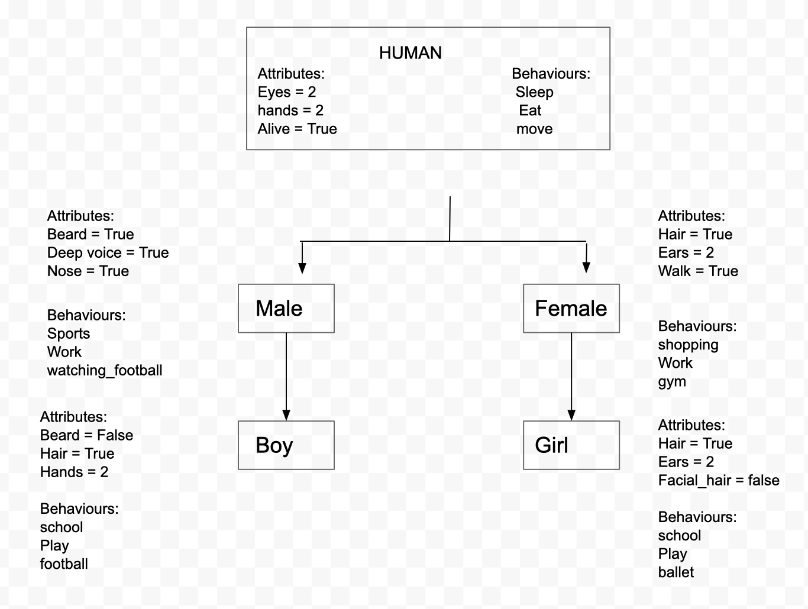

#oop activity

### Diagram



#### Human Class
````python
# Create Human class
# syntax class name:

class Human:
    # __init__ to declare class attribues (to initialise a class)

    def __init__(self): # self refers to current class
        self.eyes = True
        self.hands = 2
        self.alive = True

    def sleep(self):
        return "Humans need between 7 + hours of sleep a night"

    def eat(self):
        return "eat if you like to stay alive.. and eat healthy."

    def move(self):
        return "The human body was designed to move"


# create an object of the class before using it
human_object = Human()
print(human_object.move())
````
#### Male Class
````python
# inherit everything from Human class into male
from human import Human

# create a male class
class Male(Human): # write the name of the class in () - (parent class) to inherit
    # parent class - base class - super class

    def __init__(self):
        # need to let it know to inherit everything from parent class (Animal)
        super().__init__() # super is used to inherit everything from base class
        self.beard = True
        self.deep_voice = True
        self.nose = True

    def sports(self):
        return "Enjoy playing sport to stay active"

    def work(self):
        return "working hard..."

    def watching_football(self):
        return "Entertainment"

    # create an object of male class
male_object = Male()

print(male_object.sleep())
print(male_object.work())
````

#### Female Class
````python
# inherit everything from Human class into female
from human import Human

# create a male class
class Female(Human): # write the name of the class in () - (parent class) to inherit
    # parent class - base class - super class

    def __init__(self):
        # need to let it know to inherit everything from parent class (Animal)
        super().__init__() # super is used to inherit everything from base class
        self.hair = bool
        self.ears = 2
        self.walk = True

    def shopping(self):
        return "Shopping makes me happy!"

    def __work(self): # Private method
        return "working hard..."

    def _gym(self): # Protected method
        return "Regular exercise benefits your health"

    # create an object of female class
female_object = Female()

print(female_object.eat())
print(female_object.shopping())
````

#### Boy Class
````python
# inherit everything from Male class into boy
from male import Male

# create a boy class
class Boy(Male): # write the name of the class in () - (parent class) to inherit
    # parent class - base class - super class

    def __init__(self):
        # need to let it know to inherit everything from parent class (Animal)
        super().__init__() # super is used to inherit everything from base class
        self.facial_hair = bool
        self.hair = True
        self.hands = 2

    def school(self):
        return "I enjoy going to school"

    def play(self):
        return "I like playing with my friends"

    def football(self):
        return "Football is my favourite sport"

    # create an object of boy class
boy_object = Boy()

print(boy_object.work())
print(boy_object.school())
````

#### Girl Class
````python
# inherit everything from Female class into girl
from female import Female

# create a female class
class Girl(Female): # write the name of the class in () - (parent class) to inherit
    # parent class - base class - super class

    def __init__(self):
        # need to let it know to inherit everything from parent class (Animal)
        super().__init__() # super is used to inherit everything from base class
        self.legs = bool
        self.fingers = 5
        self.walk = True

    def school(self):
        return "School is fun!"

    def ballet(self):
        return "I enjoy ballet"

    def play(self):
        return "I like to play outside"

    # create an object of female class
girl_object = Girl()

print(girl_object.school())
print(girl_object.shopping())
````

### Key Words:
`__init__` This method is called when an object is created from a class and it allows the class to initialize the attributes of the class.

`super()` Is used to give access to methods and properties of a parent or sibling class.

`pass` Is used as a placeholder for future code and avoids getting an error when empty code is not allowed

